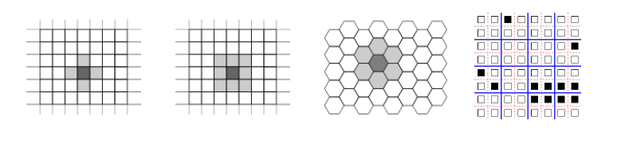
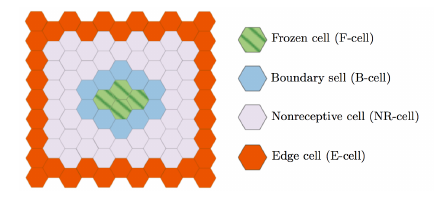
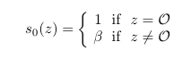
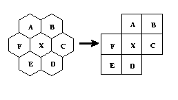
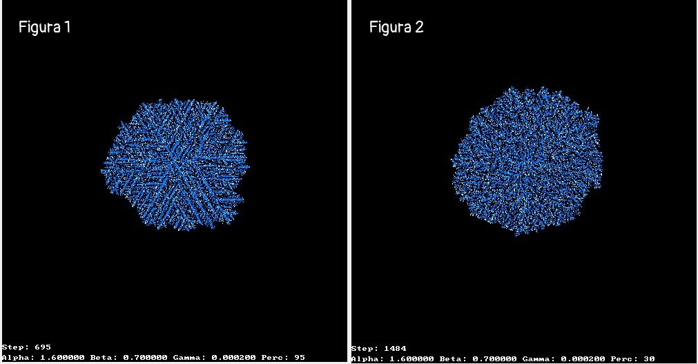
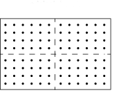
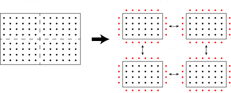
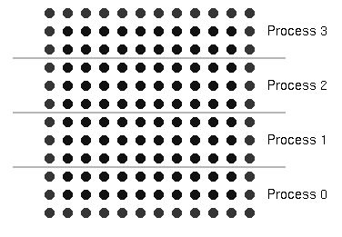
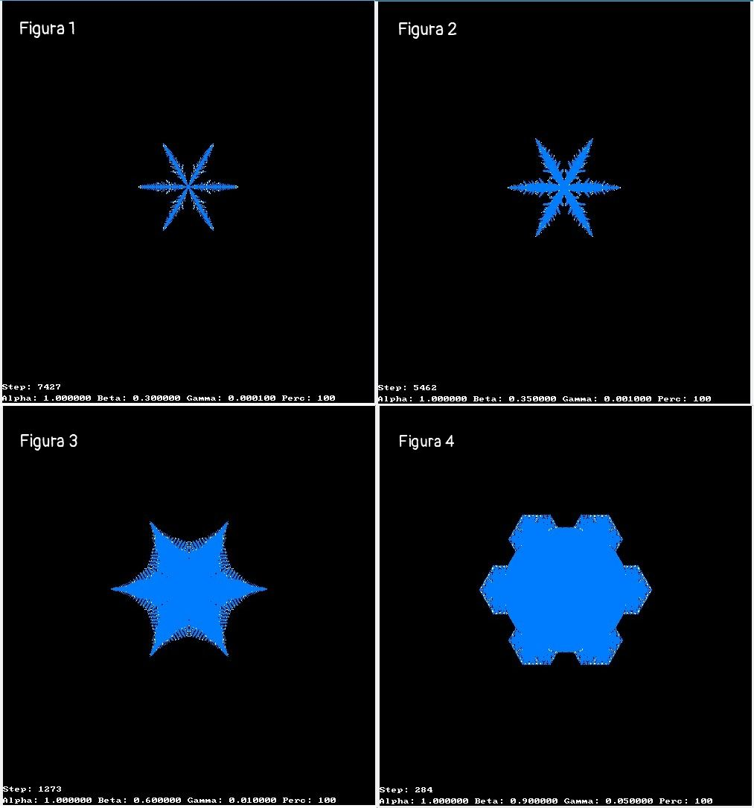
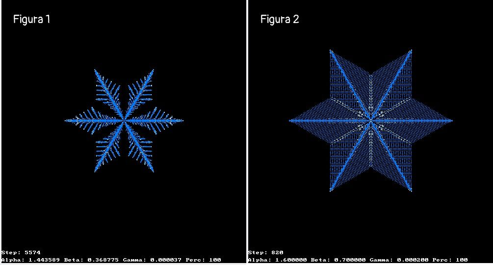

### Introduzione 

Gli  Automi Cellulari (AC) sono modelli di calcolo parallelo la cui  evoluzione è regolata da leggi puramente locali. Nella sua definizione  essenziale, un AC può essere descritto come uno spazio suddiviso in  celle regolari, ognuna delle quali può trovarsi in un numero finito di  stati. Ogni cella dell'AC ingloba, infatti, un automa finito, che è uno  dei modelli di calcolo più semplici.  

Al  tempo t=0 le celle sono in uno stato arbitrario e l'AC evolve cambiando  gli stati delle celle a passi discreti di tempo applicando  simultaneamente a ognuna la stessa legge, o funzione, di transizione. 

L'input  per ciascuna cella è dato dagli stati delle celle vicine e le  condizioni di vicinato sono determinate da una relazione geometrica,  invariante nel tempo e nello spazio. 

Nello  specifico, gli AC si prestano particolarmente bene alla modellizzazione  e simulazione di quei sistemi caratterizzati da numerosi costituenti  elementari in mutua interazione. 

Un automa cellulare è caratterizzato dalle seguenti proprietà fondamentali: 

- è formato da uno spazio d-dimensionale suddiviso in celle regolari o, equivalentemente, da un reticolo regolare d-dimensionale; 
- il numero di stati della cella è finito 
- l'evoluzione avviene a passi discreti 
- ogni cella cambia stato simultaneamente a tutte le altre in accordo alla stessa regola di transizione 
- la regola di transizione dipende dallo stato della cella stessa e dallo stato delle celle vicine 
- la relazione di vicinanza è locale, uniforme e invariante nel tempo 

La vicinanza di un automa cellulare può essere, ad esempio: 



<div class="pagebreak"></div>

### Modello di Reiter 

Il modello di Reiter è un automa esagonale. Data una tassellazione del piano in celle esagonali, ogni cella $z$ ha sei vicini. Si denota  lo stato variabile della cella $z$ al tempo $t$ che fornisce la quantità di acqua immagazzinata in $z$. 

Le celle sono divise in 3 tipi: 

- Una cella $z$ è "frozen" se $s_t(z) \ge 1$. 

- Se una cella non è "frozen" ma almeno un vicino è "frozen", la cella sarà una cella "boundary". 
- Una cella che non è né "frozen" e nemmeno "boundary" è chiamata "nonreceptive". 
- L'unione delle celle "frozen" e di quelle "boundary" sono chiamate celle "receptive" 



La condizione iniziale nel modello di Reiter è: 



In cui $\mathcal{O}$ è la cella di origine e $\beta$ rappresenta una costante fissata del livello di vapore di background. 

Inoltre si deifinisce 

- $u_t(z)$, la quantità di acqua che partecipa nella diffusione 
- $v_t(z)$, la quantità di acqua che non partecipa nella diffusione 

Quindi: 
$$
s_t(z) =  u_t(z) + v_t(z)
$$
E si fissa $v_t(z) = s_t(z)$ se $z$ è "receptive", e $u_t(z) = 0$ se $z$ è "non-receptive". 

Per $\gamma$, $\alpha$ due costanti fissate rappresentanti, rispettivamente, il vapore aggiunto e il coefficiente di diffusione, nel modello di Reiter lo stato della cella si  evolve in funzione degli stati dei suoi vicini più prossimi secondo due  regole di aggiornamento locale che riflettono i modelli matematici  sottostanti: 

- *Costante aggiuntiva*. Per ogni cella "receptive" $z$. 

  $$
  v_t^+(z) = v_t^-(z) + \gamma
  $$

- *Diffusione*. Per ogni cella z: 						 
  $$
  u_t^+(z) = u_t^-(z) + \frac{\alpha}{2} (\overline{u}_t^-(z) - u_t^-(z))
  $$


in cui si usa $\pm$ per denotare lo stato della cella prima e dopo che lo step sia completo, mentre $\overline{u}_t^-(z)$ definisce la media di $u_t^-$ per i sei vicini più prossimi della cella $z$.

Le celle ai lati sono considerate come "edge cells", in cui il valore è $u_t^+(z) = \beta$. Così, l'acqua è aggiunta al sistema attraverso queste celle nel processo di diffusione.

Conbinando le due variabili, si ottiene: 
$$
s_{t+1}(z) = u_t^+(z) + v_t^+(z)
$$


### Descrizione Automa Cellulare

$$
ReiterModel = < R, X, S, \sigma>
$$

in cui:

- $R = \{(x,y)\ |\ x,y \in \N, 0 \le x \le l_x, 0 \le y \le l_y\}$ è una regione quadrata di celle quadrate, individuate da coordinate intere. Individua lo spazio in cui si diffonde la stella.
- $X = <(0,0),(-1,0), (-1,1), (0,1), (0,-1), (1,-1), (1,0)>$ ed è la vicinanza esagonale.
- $S = S_u \times S_v $ è l'insieme finito degli stati.
- $\sigma: S^7 \to S$ è la funzione di transizione.


Quindi in dettaglio, l'automa in questione ha una matrice esagonale rappresentata come matrice quadrata. Inoltre si hanno 3 matrici, una per considerare l'acqua rimasta nel sistema, una per definire l'acqua che partecipa alla diffusione e una per definire l'acqua che non partecipa alla diffusione.

Si utilizza la vicinanza esagonale, definita come segue:

 


La funzione di transizione applica le formule definite sopra ad ogni cella, le salva in alcune matrici i cui valori saranno poi assegnati alle matrici originali.

<div class="pagebreak"></div>

### Implementazione

Inizialmente la matrice del sistema viene inizializzato a $\beta$ tranne la cella centrale che avrà come valore $1$. Da questo punto avrà inizio la diffusione e la crescita della stella.

Inoltre le matrici per la diffusione e per la costante diffusiva ($U$ e $V$) sono inizializzate come segue:

```c++
if (recep) {
    U[i][j] = 0;
    V[i][j] = grid[i][j];
}
else {
    U[i][j] = grid[i][j];
    V[i][j] = 0;
}
```

Ovvero, se è una cella "recettiva", la cella della matrice $V$ che si occupa della quantità di acqua che non partecipa alla diffusione sarà pari alla quantità presente nel sistema, altrimenti se non è "recettiva" la cella della matrice $U$ che si occupa della quantità di acqua che partecipa alla diffusione sarà pari alla quantità nel sistema.

La funzione di transizione, utilizando alcune matrici di supporto, andrà a modificare prima di tutto le matrici $U$ e $V$ come segue:

```c++
if (recep) {
    U_new[i][j] = 0;
    V_new[i][j] = grid[i][j] + gamma;
}
else {
    U_new[i][j] = grid[i][j];
    V_new[i][j] = 0;
}
```

Molto similmente all'inizializzazione, però in questo caso alle celle "recettive" della matrice $V$ viene anche aggiunto $\gamma$ ovvero il vapore aggiunto che servirà nella diffusione del passo successivo.

Per quanto riguarda la matrice del sistema, le celle vengono aggiornate seguendo la formula precedente:

```c++
for (int i=1; i < size_grid-1; i++) {
    for (int j=1; j < size_grid-1; j++) {
        bool recep = false;
        int neigh = 0;
        float sum = U[i][j] * (1.0 - alpha * 6.0 /12.0);
        for (int z = 0; z < 6 ; z++ ) 
        {
            int jx = i + neighb[z][0];
            int jy = j + neighb[z][1];

            if (isInGrid(jx,jy))
                sum += U[jx][jy] * alpha / 12.0;
        }
        grid_new[i][j] = V[i][j] + sum;
    }
  }
```

Infatti si afferma che una cella $z$ trattiene la frazione ($1 - \frac{\alpha}{2}$) di $u^-_t (z)$, distribuite uniformemente ai rimanenti suoi sei vicini e riceve la frazione $\frac{\alpha}{12}$ da ciascun vicino. La quantità totale di $u_t(z)$ verrebbe conservata all'interno dell'intero sistema, tranne per il fatto che una simulazione del mondo reale consiste in un numero finito di celle contigue.

Alla fine della funzione di transizione, le nuove matrici verranno assegnate alle vecchie per mantenerle aggiornate.


Per quanto riguarda la **rappresentazione grafica**, utilizzando la libreria *Allegro 4.0*, dopo aver eseguito la funzione di transizione, si utilizza uno scaling ed una rotazione per rappresentare il risultato in modo esagonale.

```c++
while (!(close_button_pressed || key[KEY_ESC])) {
    for (int i=0; i < size_grid; i++) {
        for (int j=0; j < size_grid; j++) {
            double tx = (i - ox)* (scale); 
            double ty = (j - oy);
            double tx0 = tx * cs45 - ty * sn45 + ox;
            ty = tx * sn45 + ty * cs45 + oy; 
            tx = tx0;
            double c;
            if (tx >= 0 and tx <= imgx1 and ty >= 0 and ty <= imgy1)
                c = grid[int((size_grid - 1) * ty / imgy1)][int((size_grid - 1) * tx / imgx1)];

            if (c >= 1)
                putpixel(buffer, i, j, blu);
            else if (c >= 0.9 and c < 1)
                putpixel(buffer, i, j, bianco);
        }
    }
    char str [] = "Alpha: %f Beta: %f Gamma: %f Perc: %i";
    textprintf_ex(buffer,font,0,size_windowY-25,bianco,nero, "Step: %i ",step);
    textprintf_ex(buffer,font,0,size_windowY-10,bianco,nero, str,alpha, beta, gamma, percentual);
    blit(buffer,screen,0,0,0,0,size_grid,size_windowY);
    clear_bitmap(buffer);

    grid = update(grid, U, V, gamma, alpha, percentual, margolus);
    step++;
}
```


In cui, le variabili per lo scaling sono definite come segue:

```c++
double imgx = size_grid-1;
double imgy = size_grid-1;
double an45 = - M_PI / 4.0;
double sn45 = sin(an45); 
double cs45 = cos(an45);
double scale = sqrt(3.0); 
double ox = imgx1 / 2.0; 
double oy = imgy1 / 2.0;
```


Inoltre, oltre alla vicinanza spiegata prima, si è tentato di utilizzare anche una vicinanza del tipo:


Ma questo ha deformato la stella di neve non facendo evolvere le ramificazioni della prima diagonale ma mantiene comunque una certa simmetria.


<div class="pagebreak"></div>

Siccome il modello appena descritto è estremamente simmetrico, si è eliminata la simmetria inserendo una probabilità nell'aggiornamento delle matrici $U$ e $V$, come segue:

```c++
int percent = rand() % 100;
if (percent <= percentual) {
    if (recep) {
        U_new[i][j] = 0;
        V_new[i][j] = grid[i][j] + gamma;
    }
    else {
        U_new[i][j] = grid[i][j];
        V_new[i][j] = 0;
    }
}
else {
    U_new[i][j] = U[i][j];
    V_new[i][j] = V[i][j];
}
```

Ovvero, se il valore random è minore di un certo valore, che viene letto da file, allora si avrà l'aggiornamento delle matrici come descritto nel modello fisico, altrimenti veranno considerati i valori correnti e non si avrà un aggiornamento.

Questo metodo **elimina la simmetria** arrivando, con un valore in input molto basso, a non avere più nessun segno di stella, ma ad avere una diffusione quasi random.




Nella **figura 1** si ha un valore pari a $95$ e, infatti, si notano le ramificazioni, e cerca di mantenere la simmetria che però non si ha perfettamente.

Invece nella **figura 2** si ha un valore pari a $30$, e si nota come la diffusione è quasi random e non si hanno ramificazioni lineari.

<div class="pagebreak"></div>

### Versione Parallelizzata

Il modello è stato implementato anche in versione parallelizzato con l'utilizzo della libreria *OpenMPI*.

La parallelizzazione è stata implementata in due versioni:

##### Topologia

Per rendere più strutturato il problema, si utilizza una topologia virtuale cartesiana in cui si mappano *4 processi* che saranno utilizzati per la computazione dell'automa cellulare. Infatti, grazie alla topologia, si creano le vicinanze.

Oltre alla topologia, ci sarà il processo *master*.

##### Decomposizione del problema

Per ottenere una buona parallelizzazione, è stato adottata una scomposizione del problema. Infatti, avendo una matrice, si divide in sottoblocchi ed ogni sottoblocco viene assegnato ad un processo.



Il processo master si occupa della divisione della matrice e dell'assegnazione agli altri processi, e della rappresentazione grafica. Questo processo manderà, a tutti gli altri processi, inizialmente le informazioni relative al blocco utilizzando *MPI_Struct* e poi il sottoblocco utilizzando *MPI_Send* e costruendolo con *MPI_Type_Vector*. 

Ogni processo si occupa quindi di una sotto-matrice di dimensione $ N_{row}/p \times N_{col}/p$.

Inoltre, ogni processo avrà bisogno di conoscere i suoi vicini in quanto l'update dell'automa, ovvero il send della sottomatrice al master, avverrà ogni tot di step, perciò nelle iterazioni intermedie ogni processo avrà bisogno di avere i bordi aggiornati per calcolare il valore esatto dell'ultima riga e l'ultima colonna del proprio sottoblocco.



Ogni processo comunicherà con i propri vicini attraverso la topologia per scambiarsi i bordi. Lo scambio dei vicini è stato effettuato con comunicazioni **non bloccanti**, per aumentare l'efficienza e diminuire la possibilità di deadlock.

Avendo usato comunicazioni non bloccanti, il processo eseguirà i seguenti step:

1. Esegue la funzione di transizione per tutto il suo sottoblocco escludendo l'ultima riga e l'ultima colonna
2. Riceve ed invia i bordi
3. Esegue la funzione di transizione sull'ultima colonna e sull'ultima riga

I bordi sono stati definiti secondo l'orientamento, *orizzontale* e *verticale*. I primi sono costruiti con un *MPI_Type_contiguos*, invece i secondi con un *MPI_Type_Vector*, per facilitarne l'invio.

Ogni processo utilizza quindi due matrici linearizzate (per ogni matrice, stato del sistema, e due sottostati) di dimensione uguali: la prima rappresenta la matrice con i dati correnti e la seconda rappresenta, invece, i valori dello stato successivo calcolati con la funzione di transizone. Alla fine della funzione, la nuova matrice sarà assegnata alla matrice dello stato corrente.


#### Versione 2

Si è implementata anche una versione linearizzata senza utilizzare topologie e costrutti. Quindi, non avendo una topologia, in questo caso anche il master collabora nella computazione.

L'invio dei bordi è uguale a prima, solo che i vicini vengono mandati in maniera **bloccante** dal master a tutti gli altri processi, in modo che loro sapranno con chi comunicare.

Quello che cambia è la divisione della matrice, perchè i sottoblocchi vengono dati a righe, quindi ogni processo avrà *N_{col}/p* righe.



Inoltre non vengono utilizzati Datatype di MPI, perciò i send saranno con lunghezza pari all'intero blocco.

##### Risultati

I test sono stati effettuati su una macchina dotata di un processo *Intel(R) Core(TM) i5-3230M CPU @ 2.60GHz* e *8 GB* di RAM. Le esecuzioni sono state lanciate in relazione alla versione dell'implementazione.

Le dimensioni per la matrice sono state:

- **500x500**
- **1000x1000**
- **2000x2000**

E sono stati eseguiti su un totale di **1000** passi.

|                          | 500x500   | 1000x1000  | 2000x2000  |
| ------------------------ | --------- | ---------- | ---------- |
| Sequenziale              | 26.007761 | 117.310752 | 374.942568 |
| Versione 1 - Send/Recv   | 16.770004 | 55.620216  | 220.641125 |
| Versione 1 - Isend/Irecv | 6.665900  | 43.605325  | 130.573338 |
| Versione 2 - 4 Processi  | 6.069994  | 40.693913  | 106.848232 |

<div class="pagebreak"></div>

### Conclusioni

Per quanto riguarda il modello originale, si sono fatte varie prove, cambiando le constanti $\alpha$, $\beta$ e $\gamma$.



I valori che sono stati utilizzati sono:

- **Figura 1:**  $\alpha = 1; \beta = 0.30; \gamma = 0.0001$
- **Figura 2:**  $\alpha = 1; \beta = 0.35; \gamma = 0.001$
- **Figura 3:**  $\alpha = 1; \beta = 0.6; \gamma = 0.01$
- **Figura 4:**  $\alpha = 1; \beta = 0.9; \gamma = 0.05$

<div class="pagebreak"></div>

In aggiunta si è variata anche la variabile $\alpha$, ottenendo:



I cui valori sono:

- **Figura 1:**  $\alpha = 1.443589; \beta = 0.368775; \gamma = 0.000037$
- **Figura 2:**  $\alpha = 1.6; \beta = 0.7; \gamma = 0.0002$


Con questi risultati si può vedere che quando $\gamma$ è molto basso, il sistema evolve in maniera più lenta, perchè viene aggiunto vapore nel sistema in modo molto più lento e quindi non si ha solidificazione.

Inoltre con un $\beta$ maggiore si hanno stelle più fitte e non ramificate come si osserva con un $\beta < 0.40$ perchè con l'intero sistema è inizializzato a questa costante, quindi la diffusione sarà maggiore per tutte le celle nel sistema e non solo per quelle vicine al primo punto.

Invece, variando $\alpha$ si ha diffusione maggiore per ogni ramo, questo perchè è la costante di diffusione.

